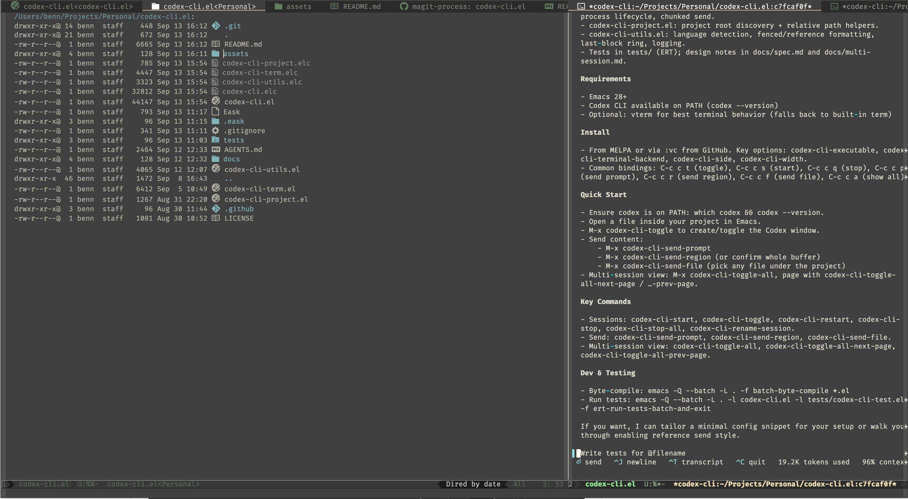
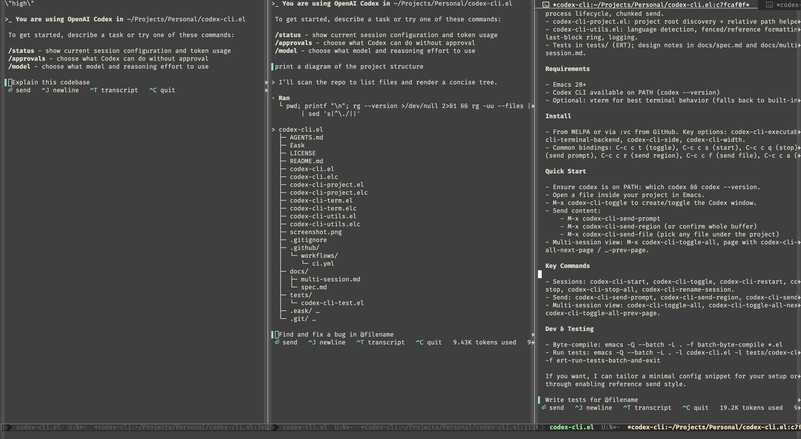

# codex-cli.el

Run Codex CLI inside Emacs — project‑scoped terminals, predictable windows, and a few high‑leverage helpers for sending prompts, regions, and files. Small surface. Stable defaults.






## Highlights

- Project‑scoped Codex terminals (multiple sessions per project)
- Side window toggle with fixed width and optional focus
- “Show All Sessions” view with automatic column layout and paging
- Send prompt, active region, or any file under the project
- Smart chunking for large sends + optional per‑session preamble
- Optional log buffer mirroring injected content

Non‑goals: MCP tools, Flycheck/Flymake bridges, ediff patch workflows, big menus.


## Requirements

- Emacs 28+
- Codex CLI on PATH (`codex --version`)
- Optional: `vterm` (falls back to built‑in `term`)


## Install

MELPA or directly from GitHub via `:vc`:

```elisp
(use-package codex-cli
  ;; For MELPA: :ensure t
  ;; For GitHub (Emacs 29+):
  ;; :vc (:fetcher github :repo "bennfocus/codex-cli.el")
  :bind (("C-c c t" . codex-cli-toggle)
         ("C-c c s" . codex-cli-start)
         ("C-c c q" . codex-cli-stop)
         ("C-c c Q" . codex-cli-stop-all)
         ("C-c c p" . codex-cli-send-prompt)
         ("C-c c r" . codex-cli-send-region)
         ("C-c c f" . codex-cli-send-file)
         ;; Show-all layout + paging
         ("C-c c a" . codex-cli-toggle-all)
         ("C-c c n" . codex-cli-toggle-all-next-page)
         ("C-c c b" . codex-cli-toggle-all-prev-page))
  :init
  (setq codex-cli-executable "codex"
        codex-cli-terminal-backend 'vterm
        codex-cli-side 'right
        codex-cli-width 90))
```


## Quick Start

1) Verify Codex CLI:

```bash
which codex && codex --version
```

2) Open a file inside a project in Emacs.

3) Start/toggle the session window:

- `M-x codex-cli-toggle` (creates if none; toggles otherwise)
- Or `C-c c t` with the binding above

4) Try sending content:

- `M-x codex-cli-send-prompt` → paste text into the terminal
- Select a region → `M-x codex-cli-send-region`
- `M-x codex-cli-send-file` → choose any file under the project

5) Show all sessions for the project in columns:

- `M-x codex-cli-toggle-all` (`C-c c a`), then page with `C-c c n` / `C-c c b`


## Commands

- `codex-cli-start` — start a new session (auto id if unnamed)
- `codex-cli-toggle` — project‑aware toggle; prompts to create when none exist
- `codex-cli-restart` — kill and start again in the same buffer
- `codex-cli-stop` — choose an existing session and terminate it
- `codex-cli-rename-session` — rename a session (and its log buffer)
- `codex-cli-stop-all` — stop sessions in bulk (current project or all projects)

Send helpers:
- `codex-cli-send-prompt` — minibuffer → terminal
- `codex-cli-send-region` — active region or whole buffer
- `codex-cli-send-file` — pick and send a file under the project

Multi‑session view:
- `codex-cli-toggle-all` — show all sessions as columns; call again to restore layout
- `codex-cli-toggle-all-next-page` / `codex-cli-toggle-all-prev-page` — cyclic paging

Tips:
- Use `C-u M-x codex-cli-start` to provide a custom session name (blank = auto id).
- `codex-cli-toggle`/`codex-cli-stop` auto‑select when only one session exists.


## Window & Sessions

- Windows: side window on `codex-cli-side` with width `codex-cli-width` when using `codex-cli-toggle`.
- Sessions: multiple per project; buffers are named `*codex-cli:PROJECT:SESSION*`.
- Show All: `codex-cli-toggle-all` arranges sessions as columns. If the frame is too narrow, sessions are split into pages and you can cycle pages. First call saves the current layout; calling again restores it.

Defaults you may want to adjust:

```elisp
(setq codex-cli-focus-on-open t)          ;; select the Codex window on open
(setq codex-cli-toggle-all-min-width 60)  ;; min column width per session in show-all
```


## Sending Content

By default, sends are wrapped as fenced code blocks, optionally with a header:

````
# File: relative/path/to/file.ext
```<lang>
<content>
```
````

Language is detected from major mode or file extension. If unknown, it’s omitted.

Alternatively, enable reference tokens instead of full content:

```elisp
(setq codex-cli-send-style 'reference)
(setq codex-cli-reference-prefix "")     ;; e.g., "i " if your CLI expects it
(setq codex-cli-reference-format-single "@%s#L%d")
(setq codex-cli-reference-format-range  "@%s#L%d-%d")
(setq codex-cli-reference-file-format   "@%s")
```

With `reference` style, `codex-cli-send-region` emits `@path#Lstart-end` when the buffer visits a file; otherwise it falls back to fenced content. `codex-cli-send-file` emits `@path`.


## Configuration Cheatsheet

Core:
- `codex-cli-executable` — path to Codex CLI binary
- `codex-cli-extra-args` — extra args passed to the CLI
- `codex-cli-terminal-backend` — `vterm` or `term`
- `codex-cli-side` / `codex-cli-width` — side window position and width
- `codex-cli-focus-on-open` — focus the window when shown

Sends:
- `codex-cli-max-bytes-per-send` — chunk size for large sends
- `codex-cli-send-style` — `fenced` (default) or `reference`
- `codex-cli-session-preamble` — text injected once per session
- `codex-cli-log-injections` — mirror injected content to a log buffer

Show‑All view:
- `codex-cli-toggle-all-min-width` — minimal column width per session


## Development

Reload during development:

- Quick: open the file and `M-x eval-buffer`
- Full reload:

```elisp
(unload-feature 'codex-cli t)
(load (expand-file-name "/path/to/codex-cli.el/codex-cli.el") nil 'nomessage)
```

Byte‑compile and run tests:

```bash
emacs -Q --batch -L . -f batch-byte-compile *.el
emacs -Q --batch -L . -l codex-cli.el -l tests/codex-cli-test.el -f ert-run-tests-batch-and-exit
```


## Troubleshooting

- Codex not found → set `codex-cli-executable` to the full path and verify `(executable-find codex-cli-executable)`
- Window too narrow → increase `codex-cli-width` (toggle view) or decrease `codex-cli-toggle-all-min-width` (show‑all)
- Focus preference → toggle `codex-cli-focus-on-open`
- Unicode/paste quirks → use `vterm` backend
- Wrong project root → open a file inside the repo or set `default-directory`


## License

MIT


## References

- docs/spec.md — design notes
- docs/multi-session.md — multi‑session implementation details
Inspired by the excellent editor‑agent integration patterns in the Emacs community. Built as a clean, minimal alternative tailored for Codex CLI.
