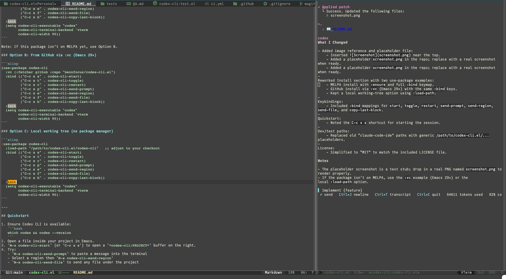

# codex-cli.el

Emacs integration for **Codex CLI**. It runs the Codex terminal UI inside Emacs per project and gives you a few high‑leverage helpers for sending prompts, regions, and files. No MCP. No diagnostics. No patch reviewer. Small surface, stable defaults.



**Status:** v0.1 (minimal feature set)

---

## Features

- Launch Codex CLI in a project‑scoped terminal buffer
- Side window on the right with fixed width
- Optional focus of the Codex window when shown
- Send prompt from minibuffer, active region, or any file under the project
- Smart chunking for large sends with progress messages
- Optional per‑session preamble injected once
- Last‑block resend and optional injection log buffer

Non‑goals for v0.1: MCP tools, Flycheck/Flymake bridges, ediff workflows, complex menus.

---

## Requirements

- Emacs 28 or newer
- **Codex CLI** installed and on PATH (`codex --version` should work)
- Optional: `vterm` for a better terminal; falls back to built‑in `term`

---

## Install

### Option A: MELPA (use-package)

Ensure MELPA is configured, then:

```elisp
(use-package codex-cli
  :ensure t
  :bind (("C-c c c" . codex-cli-start-or-toggle)
         ("C-c c q" . codex-cli-stop)
         ("C-c c p" . codex-cli-send-prompt)
         ("C-c c r" . codex-cli-send-region)
         ("C-c c f" . codex-cli-send-file)
         ("C-c c b" . codex-cli-copy-last-block))
  :init
  (setq codex-cli-executable "codex"
        codex-cli-terminal-backend 'vterm
        codex-cli-width 90))
```

Note: If this package isn’t on MELPA yet, use Option B.

### Option B: From GitHub via :vc (Emacs 29+)

```elisp
(use-package codex-cli
  :vc (:fetcher github :repo "bennfocus/codex-cli.el")
  :bind (("C-c c c" . codex-cli-start-or-toggle)
         ("C-c c q" . codex-cli-stop)
         ("C-c c p" . codex-cli-send-prompt)
         ("C-c c r" . codex-cli-send-region)
         ("C-c c f" . codex-cli-send-file)
         ("C-c c b" . codex-cli-copy-last-block))
  :init
  (setq codex-cli-executable "codex"
        codex-cli-terminal-backend 'vterm
        codex-cli-width 90))
```

### Option C: Local working tree (no package manager)

```elisp
(use-package codex-cli
  :load-path "/path/to/codex-cli.el"   ;; adjust to your checkout
  :bind (("C-c c c" . codex-cli-start-or-toggle)
         ("C-c c q" . codex-cli-stop)
         ("C-c c p" . codex-cli-send-prompt)
         ("C-c c r" . codex-cli-send-region)
         ("C-c c f" . codex-cli-send-file)
         ("C-c c b" . codex-cli-copy-last-block))
  :init
  (setq codex-cli-executable "codex"
        codex-cli-terminal-backend 'vterm
        codex-cli-width 90))
```

---

## Quickstart

1. Ensure Codex CLI is available:
   ```bash
   which codex && codex --version
   ```
2. Open a file inside your project in Emacs.
3. `M-x codex-cli-start` (or `C-c x s`) to open a `*codex-cli:PROJECT*` buffer on the right.
4. Try:
   - `M-x codex-cli-send-prompt` to paste a message into the terminal
   - Select a region then `M-x codex-cli-send-region`
   - `M-x codex-cli-send-file` to send any file under the project

---

## Commands

- `codex-cli-start` start or focus the session for the current project
- `codex-cli-start-or-toggle` start if absent, otherwise toggle the window
- `codex-cli-toggle` show or hide the side window without killing the process
- `codex-cli-restart` kill and start again in the same buffer
- `codex-cli-stop` terminate the process and bury the buffer
- `codex-cli-send-prompt` minibuffer input pasted into the terminal
- `codex-cli-send-region` send active region or whole buffer as a fenced block
- `codex-cli-send-file` pick a project file and send as a fenced block
- `codex-cli-copy-last-block` re‑send the last injected block

---

## Configuration

```elisp
(defgroup codex-cli nil
  "Run Codex CLI inside Emacs with helpers."
  :group 'tools :prefix "codex-cli-")

(defcustom codex-cli-executable "codex" "Path to Codex CLI.")
(defcustom codex-cli-extra-args nil "List of extra args passed to Codex CLI.")
(defcustom codex-cli-side 'right "Side window placement: left or right.")
(defcustom codex-cli-width 90 "Side window width in columns.")
(defcustom codex-cli-terminal-backend 'vterm "Preferred terminal backend: vterm or term.")
(defcustom codex-cli-max-bytes-per-send 8000 "Chunk size for large sends.")
(defcustom codex-cli-session-preamble nil "Optional text to inject once after start.")
(defcustom codex-cli-log-injections t "Mirror injected blocks into a log buffer.")
(defcustom codex-cli-focus-on-open t "Select the Codex side window after displaying it.")
```

**Content formatting**

By default, the package wraps content with a header and a fenced code block:

````
# File: relative/path/to/file.ext
```<lang>
<content>
```
````

The language tag is guessed from the current major mode or file extension. If unknown, it is omitted.

Alternatively, you can send file references instead of full content:

```
@relative/path/to/file.ext#L17-26
```

Enable this style and tweak formatting via:

```elisp
(setq codex-cli-send-style 'reference)
(setq codex-cli-reference-prefix "")   ;; e.g., "i " if your CLI expects it
(setq codex-cli-reference-format-single "@%s#L%d")
(setq codex-cli-reference-format-range  "@%s#L%d-%d")
(setq codex-cli-reference-file-format   "@%s")
```

When using `reference` style, `codex-cli-send-region` emits a file+line token if the buffer visits a file; otherwise it falls back to fenced content. `codex-cli-send-file` emits a whole‑file token like `@path`.

---

## Development and reload loop

Fast path while editing:

- Open the changed file and `M-x eval-buffer`

Hard reload when you changed many files:

```elisp
(unload-feature 'codex-cli t)
(load (expand-file-name "/path/to/codex-cli.el/codex-cli.el") nil 'nomessage)
```

If Emacs reports dependencies are still loaded, unload in reverse order:

```elisp
(mapc (lambda (f) (ignore-errors (unload-feature f t)))
      '(codex-cli-term codex-cli-utils codex-cli-project codex-cli))
(load (expand-file-name "/path/to/codex-cli.el/codex-cli.el") nil 'nomessage)
```

Byte‑compile to catch warnings:

```bash
emacs -Q --batch -L /path/to/codex-cli.el \
  -f batch-byte-compile /path/to/codex-cli.el/*.el
```

---

## Tests

If you added ERT tests as suggested in `tasks.md`:

```bash
emacs -Q --batch \
  -L /path/to/codex-cli.el \
  -l /path/to/codex-cli.el/codex-cli.el \
  -l /path/to/codex-cli.el/tests/codex-cli-test.el \
  -f ert-run-tests-batch-and-exit
```

---

## Troubleshooting

- **Codex not found** set `(setq codex-cli-executable "/full/path/to/codex")` and verify `(executable-find codex-cli-executable)`
- **Window size** tweak `(setq codex-cli-width 100)` and restart the session
- **Focus behavior** enable `(setq codex-cli-focus-on-open t)` to select the Codex window when it opens
- **Unicode or paste issues** install `vterm` or set `(setq codex-cli-terminal-backend 'vterm)`
- **Wrong project root** open a file inside the repo or set `default-directory` before starting
- **Preamble runs twice** increase the post‑spawn idle delay in your code a little

---

## Roadmap

- v0.1 minimal (this release)
- v0.2 small hydra or transient for core actions and `.dir-locals.el` preamble support

For the full design, see `spec.md`.

---

## License

MIT

---

## Acknowledgments

Inspired by the excellent editor‑agent integration patterns in the Emacs community. Built as a clean, minimal alternative tailored for Codex CLI.
